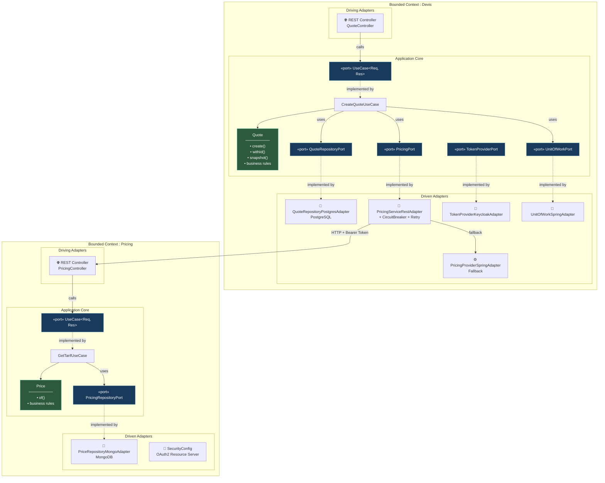

# Insurance Quote Management

Système de gestion de devis d'assurance construit avec l'**Architecture Hexagonale**, le **Domain-Driven Design** et le **Test-Driven Development**.

## Contexte

Ce projet est un playground pour explorer les bonnes pratiques de développement logiciel appliquées à un domaine métier concret : la création de devis d'assurance.

L'objectif n'est pas de livrer un produit fini, mais de démontrer comment les principes du **Software Craftsmanship** — architecture hexagonale, DDD, TDD, résilience — s'articulent ensemble dans un système multi-modules réaliste.

Le système permet à un agent d'assurance de créer des devis pour ses clients. Le tarif est calculé par un service de pricing externe, avec un mécanisme de fallback si le service est indisponible.

---

## Architecture

### Vue d'ensemble — Deux Bounded Contexts, deux hexagones



### Structure multi-modules Maven

Chaque Bounded Context suit la même organisation en trois couches physiquement séparées :

```
{context}/
├── application-core/        ← Domaine pur (zéro dépendance framework)
│   ├── domain/model/        ← Entités, Value Objects, règles métier
│   ├── port/api/            ← Ports entrants (driving)
│   ├── port/spi/            ← Ports sortants (driven)
│   └── usecase/             ← Cas d'utilisation (orchestration)
│
├── infrastructure/          ← Adaptateurs techniques
│   ├── adapter-restapi/     ← Adaptateur entrant REST (Spring MVC)
│   ├── adapter-persistence/ ← Adaptateur sortant JPA/MongoDB
│   ├── adapter-pricing-rest/← Adaptateur sortant HTTP (inter-service)
│   └── adapter-auth/        ← Adaptateur sortant Keycloak
│
└── starter/                 ← Assemblage Spring Boot + tests de composants
```

### La règle de dépendance — prouvée par Maven

Le principe fondamental de l'architecture hexagonale est que **le domaine ne dépend de rien**. Dans ce projet, ce n'est pas une convention — c'est une **contrainte physique** imposée par la structure Maven.

Le `pom.xml` du module `application-core-devis` :

```xml
<dependencies>
    <!-- Seules dépendances : test -->
    <dependency>
        <groupId>org.junit.jupiter</groupId>
        <artifactId>junit-jupiter</artifactId>
    </dependency>
    <dependency>
        <groupId>org.assertj</groupId>
        <artifactId>assertj-core</artifactId>
    </dependency>
</dependencies>
```

**Aucune trace de Spring, JPA, Kafka, ou tout autre framework.** Si un développeur essaie d'importer `@Entity` ou `@Service` dans le domaine, Maven refuse de compiler. La règle de dépendance n'est pas un gentlemen's agreement — elle est **compilée**.

---

## Bounded Contexts

| Module | Responsabilité | Base de données | Authentification |
|--------|---------------|-----------------|------------------|
| **devis** | Création et gestion des devis | PostgreSQL (JPA) | Keycloak (client credentials) |
| **pricing** | Calcul des tarifs par produit/profil | MongoDB | Keycloak (resource server) |

Les deux contextes communiquent via **HTTP REST** avec authentification OAuth2 (Bearer Token). Le service Devis est **client** du service Pricing — il obtient un token via Keycloak et appelle l'API Pricing pour récupérer le tarif.

---

## Règles de gestion

### Devis (Quote)

| Règle | Validation |
|-------|-----------|
| Capital positif | `capital > 0` |
| Durée positive | `duration > 0` |
| Âge du client | `18 ≤ age ≤ 90` |
| Tarif positif | `tarif > 0` |
| Produits disponibles | `AUTO`, `HEALTH` |
| Statuts possibles | `CREATED`, `VALIDATED`, `EXPIRED`, `ERROR` |

### Tarification

| Règle | Comportement |
|-------|-------------|
| Service disponible | Le tarif calculé par le service Pricing est utilisé |
| Service indisponible | Un tarif par défaut (fallback) est appliqué |

> **Toutes les règles métier sont validées dans le constructeur de `Quote`** — un objet `Quote` invalide ne peut pas exister. C'est le principe DDD du **toujours-valide** (*always-valid domain model*).

---

## Design Patterns

### Snapshot Pattern — Séparer le domaine de la persistance

Un piège classique de l'architecture hexagonale est de confondre le modèle de domaine avec l'entité de persistance. Le `Quote.java` du domaine porterait alors des annotations `@Entity`, `@Column`, etc. — et l'hexagone serait percé.

Ce projet utilise le **Snapshot Pattern** pour maintenir une séparation stricte :

```
Quote (domaine)          QuoteSnapshot (DTO interne)         QuoteEntity (JPA)
┌──────────────┐        ┌───────────────────┐               ┌──────────────────┐
│ • rules      │──snap──▶│ • flat record     │──fromSnap────▶│ • @Entity        │
│ • behavior   │◀──────── │ • no behavior     │◀──toSnap───── │ • @Column        │
│ • invariants │        └───────────────────┘               │ • JPA concerns   │
└──────────────┘                                            └──────────────────┘
```

**`Quote`** — L'entité domaine avec ses règles, ses invariants, ses comportements. Aucune annotation framework.

**`QuoteSnapshot`** — Un `record` Java immuable qui capture l'état d'un `Quote` à un instant T. C'est le contrat entre le domaine et le monde extérieur. Défini dans le module core, utilisé par les adaptateurs.

**`QuoteEntity`** — L'entité JPA dans l'adaptateur de persistance. Porte les annotations `@Entity`, `@Column`, etc. Sait convertir depuis/vers un `QuoteSnapshot`.

```java
// Domaine → Snapshot → Persistence
var snapshot = quote.snapshot();                        // Quote → QuoteSnapshot
var entity = QuoteEntity.fromSnapshot(snapshot);        // QuoteSnapshot → QuoteEntity
springDataRepository.save(entity);

// Persistence → Snapshot → Domaine
var entity = springDataRepository.findById(id);
var snapshot = entity.toSnapshot();                     // QuoteEntity → QuoteSnapshot
```

**Pourquoi ce "boilerplate" ?** Parce que le jour où on migre de PostgreSQL vers un autre système de stockage, on change **un seul adaptateur**. Le domaine et les use cases ne bougent pas.

### Resilience Pattern — Circuit Breaker + Retry + Fallback

Le service Devis appelle le service Pricing via HTTP. En production, ce service peut être lent, surchargé, ou down. Le projet implémente une **stratégie de résilience en trois niveaux** avec Resilience4j :

```
Appel HTTP vers Pricing
         │
         ▼
    ┌─────────┐     Succès
    │  Retry  │────────────────▶ Tarif du service Pricing
    │ (3 max) │
    └────┬────┘
         │ Échecs répétés
         ▼
  ┌──────────────┐
  │ Circuit      │  Ouvert → court-circuite les appels
  │ Breaker      │
  └──────┬───────┘
         │ Toutes tentatives échouées
         ▼
  ┌──────────────┐
  │  Fallback    │────────────▶ Tarif par défaut (configurable)
  └──────────────┘
```

```java
@Override
@CircuitBreaker(name = PRICING_SERVICE)
@Retry(name = PRICING_SERVICE, fallbackMethod = "fallbackTarif")
public Pricing getTarif(ProductType type, Profil profil) {
    String token = tokenProviderPort.getAccessToken();
    return pricingHttpClient.getTarif(type, profil.age(), "Bearer " + token);
}

private Pricing fallbackTarif(Throwable throwable) {
    BigDecimal defaultPrice = pricingConfigProvider.getDefaultPrice();
    return new Pricing(defaultPrice);
}
```

**Le domaine ne sait rien de tout ça.** Le `CreateQuoteUseCase` appelle `pricingPort.getTarif()` — que la réponse vienne du vrai service ou du fallback, c'est transparent. C'est la puissance de l'architecture hexagonale : la résilience est un **détail d'infrastructure**.

### Annotation `@DomainDevisService` — Scanner le domaine sans le polluer

Le domaine ne connaît pas Spring. Mais Spring doit quand même découvrir les use cases pour les injecter. Solution : une **annotation custom** définie dans le core :

```java
@Retention(RetentionPolicy.RUNTIME)
public @interface DomainDevisService { }
```

Côté infrastructure, un `@ComponentScan` filtre sur cette annotation :

```java
@Configuration
@ComponentScan(includeFilters = {
    @ComponentScan.Filter(type = FilterType.ANNOTATION, classes = {DomainDevisService.class})
})
public class DomainDevisConfiguration { }
```

Le domaine reste **ignorant de Spring** tout en étant découvert par le framework. L'annotation est définie dans le core comme un simple marqueur Java — aucune dépendance Spring n'est nécessaire.

---

## Stratégie de test

### Pyramide de tests du projet

```
                    ┌───────────────────┐
                    │   Component Tests │  Cucumber + Testcontainers + WireMock
                    │   (starter-devis) │  → Vrais conteneurs (PostgreSQL, Keycloak)
                    │                   │  → Services externes stubbés (WireMock)
                    ├───────────────────┤
                    │                   │
                    │   Unit Tests      │  JUnit 5 + AssertJ + Fakes in-memory
                    │  (application-    │  → Zéro framework, zéro mock
                    │   core-*)         │  → Exécution en millisecondes
                    │                   │
                    └───────────────────┘
```

### Pourquoi des Fakes et pas Mockito ?

Ce projet suit l'approche **Classicist TDD** (London vs. Chicago — ici, on est côté Chicago). Les tests du domaine utilisent des **Fake Objects** au lieu de mocks Mockito :

```java
// ❌ Mockist — vérifie les interactions (fragile, couplé à l'implémentation)
@Mock QuoteRepositoryPort mockRepo;
when(mockRepo.save(any())).thenReturn(snapshot);
verify(mockRepo).save(any(Quote.class));

// ✅ Classicist — vérifie le résultat via un Fake (robuste, teste le comportement)
var fakeRepo = new FakeQuoteRepository();
createQuoteUseCase.execute(command);
assertThat(fakeRepo.allSnapshots()).containsExactly(expectedSnapshot);
```

**`FakeQuoteRepository`** — Implémente `QuoteRepositoryPort` avec une simple `ArrayList`. On vérifie ce qui a été sauvegardé, pas *comment* ça a été sauvegardé.

**`FakeSystemPricing`** — Implémente `PricingPort` avec un comportement configurable (`enableFallback()`). Simule la disponibilité ou l'indisponibilité du service Pricing.

**`FakeUnitOfWork`** — Implémente `UnitOfWorkPort` en exécutant directement le `Supplier`. Pas de transaction réelle en test unitaire.

**Avantages :**
- Les tests survivent au refactoring (pas de `verify()` fragiles)
- Les tests documentent le comportement métier, pas l'implémentation
- Exécution quasi-instantanée (pas de proxy Mockito, pas de Spring)

### Tests de composants — BDD avec Cucumber

Les tests dans `starter-devis` sont des **tests de composants** : l'application Spring Boot démarre avec de vrais conteneurs (PostgreSQL, Keycloak) mais les services externes sont stubbés avec WireMock.

```gherkin
Feature: Creating an insurance quote when pricing service is available
  In order to provide a price to a customer
  As an insurance agent
  I want to create a quote and receive the calculated price

  Background:
    Given the pricing service is available

  Scenario: Create a car insurance quote successfully
    Given the agent enter the following information's:
      | customerId                           | productType | age | capital | duration |
      | 123e4567-e89b-12d3-a456-426614174000 | AUTO        | 30  | 20000   | 12       |
    When the agent makes a new quote
    Then the agent receives the following quote details:
      | field       | expected value                       |
      | quoteId     | GENERATED                            |
      | status      | CREATED                              |
      | tarif       | 300.0                                |
```

**Testcontainers** — PostgreSQL et Keycloak démarrent dans des conteneurs Docker gérés par le cycle de vie des tests.

**WireMock** — Le service Pricing est stubbé. On peut simuler un service disponible (retourne un tarif) ou indisponible (retourne 503) pour tester le fallback.

```
Feature: Creating an insurance quote when pricing service is not available
  Background:
    Given the pricing service is not available
  ...
    Then the agent receives the following quote details:
      | tarif       | 500.0  |   ← tarif par défaut (fallback)
```

---

## Use Cases

### Create Quote

Permet à un agent d'assurance de créer un devis pour un client.

```java
// 1. Le REST Controller (driving adapter) reçoit la requête HTTP
@PostMapping("/v1/quote")
public ResponseEntity<CreateQuoteResponse> createQuote(@RequestBody @Valid CreateQuoteRequest request)

// 2. Le Controller mappe le DTO vers la commande du use case
CreateQuoteRequest useCaseRequest = QuoteDtoMapper.INSTANCE.mapToCreateQuoteCmd(request);

// 3. Le UseCase orchestre la logique dans une transaction (UnitOfWork)
unitOfWork.execute(() -> {
    BigDecimal tarif = pricingPort.getTarif(productType, profil);    // Port sortant
    Quote quote = Quote.create(customerId, productType, age, ...);   // Domaine
    QuoteSnapshot snapshot = quoteRepoPort.save(quote);              // Port sortant
    return CreateQuoteResponse.fromSnapshot(snapshot);
});
```

### Get Tarif

Permet de récupérer le tarif pour un type de produit et un profil client donné.

```java
// 1. Le REST Controller (driving adapter) reçoit la requête HTTP
@GetMapping("/v1/pricing")
public ResponseEntity<GetPricingResponse> getTarif(ProductType productType, Integer age)

// 2. Le UseCase crée un objet domaine Price et cherche le tarif
Price price = Price.of(productType, profil);                         // Domaine
TarifQuoteView tarif = pricingRepo.getTarif(productType, profil);    // Port sortant
```

---

## Stack technique

| Catégorie | Technologies |
|-----------|-------------|
| **Langage** | Java 21 |
| **Framework** | Spring Boot 4, Spring Framework 7 |
| **Persistance** | PostgreSQL (JPA/Hibernate), MongoDB |
| **Sécurité** | Keycloak, OAuth2 (client credentials + resource server) |
| **Résilience** | Resilience4j (Circuit Breaker, Retry) |
| **Tests unitaires** | JUnit 5, AssertJ, Fake Objects (Classicist TDD) |
| **Tests composants** | Cucumber, Testcontainers, WireMock |
| **API** | OpenAPI Generator (contract-first) |
| **Build** | Maven multi-modules |

## Prérequis

- Java 21
- Maven 3.9+
- Docker (pour Testcontainers)

## Build & Run

```bash
# Build du module devis
cd devis && ./mvnw clean install

# Build du module pricing
cd pricing && ./mvnw clean install

# Lancer l'application devis
cd devis/starter-devis && ./mvnw spring-boot:run

# Lancer l'application pricing
cd pricing/starter-pricing && ./mvnw spring-boot:run
```

## Tests

```bash
# Tests unitaires (domaine pur, millisecondes)
./mvnw test -pl application-core-devis

# Tests de composants (Cucumber + Testcontainers + WireMock)
./mvnw test -pl starter-devis
```

> **Note** : Les tests dans `starter-devis` sont des tests de **composants**, pas des tests E2E. Les services externes sont stubbés avec WireMock. La vraie base de données (PostgreSQL) et le vrai Keycloak tournent dans des conteneurs Docker via Testcontainers.

## Documentation API

Spécifications OpenAPI (contract-first) :
- `devis/infrastructure-devis/adapter-restapi-spring-devis/src/main/resources/openapi/api.yaml`
- `pricing/infrastructure-pricing/adapter-restapi-pricing-spring/src/main/resources/openapi/api.yaml`
